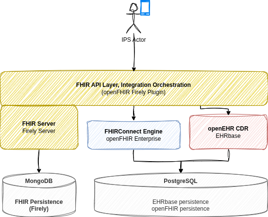
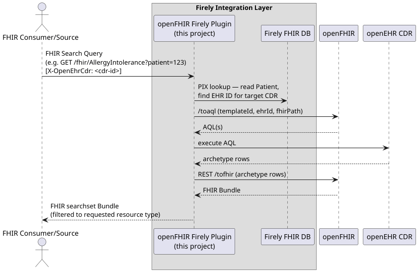

# FHIR-openEHR IPS Integration with User Interface

> **Enhanced Version** - This project extends the original [openFHIR Converge & Collaborate Dublin 2026](https://github.com/openFHIR/converge-and-collaborate-dublin-hackaton) tutorial with a user-friendly web interface featuring animated architecture visualizations.

## 🎯 What This Project Does

A complete FHIR facade implementation on top of openEHR CDR, demonstrating International Patient Summary (IPS) interoperability. Features include:

- ✅ **FHIR-to-openEHR bidirectional translation** using FHIRConnect mappings
- ✅ **Interactive Web UI** built with Astro and React
- ✅ **Animated architecture diagrams** showing real-time data flow
- ✅ **Patient management** with search and bundle upload
- ✅ **IPS summary viewer** with structured sections
- ✅ **Non-technical user friendly** interface

## 🚀 Quick Start

1. Get a [Firely Server trial license](https://fire.ly/firely-server-trial/)
2. Place `firely-license.json` in the `config/` folder
3. Run `docker compose up -d`
4. Access the UI at **http://localhost:3000**
5. Access FHIR API at **http://localhost:4080**

## 📊 User Interface Features

The web interface provides:
- **Dashboard**: System overview with animated architecture
- **Patient Management**: Create, search, and view patients
- **Bundle Upload**: Submit IPS Bundles with preview and validation
- **Summary Viewer**: Display patient IPS with sections for allergies, conditions, medications, and devices
- **Visual Flow Diagrams**: Real-time animated visualizations of FHIR query, store, and summary operations

## Lets Build: openEHR-to-FHIR IPS Integration

This session walks through building a working FHIR facade on top of an openEHR CDR, using the International Patient
Summary (IPS) as the target use case.

The facade sits between FHIR clients and an openEHR CDR, translating FHIR requests into AQL queries and openEHR
compositions into FHIR resources on the fly, using [FHIRConnect](https://github.com/SevKohler/FHIRconnect-spec) mappings
as the translation layer.

### Target Architecture



| Flow | Diagram |
|------|---------|
| Querying FHIR resources (e.g. `GET /AllergyIntolerance`) |  |
| Storing FHIR resources (e.g. `POST` IPS Bundle) |  |
| Fetching the IPS summary document (`$summary`) |  |

### Tutorial Steps

Each step builds on the previous one, incrementally adding services to a single `docker-compose.yml` that is fully
runnable at the end of each step. Follow the README in each subfolder.

| Step | What you build | Folder |
|------|---------------|--------|
| 1 | Firely Server + MongoDB running locally | [tutorial/step1](tutorial/step1/) |
| 2 | openFHIR Firely Plugin installed into Firely Server | [tutorial/step2](tutorial/step2/) |
| 3 | openFHIR running locally | [tutorial/step3](tutorial/step3/) |
| 4 | All services wired together — Firely → openFHIR → openEHR CDR | [tutorial/step4](tutorial/step4/) |
| 5 | Existing IPS FHIRConnect mappings bootstrapped into openFHIR | [tutorial/step5](tutorial/step5/) |
| 6 | Create a patient, ingest an IPS Bundle, test existing mappings end-to-end | [tutorial/step6](tutorial/step6/) |
| 7 | New FHIRConnect mappings for the IPS Medical Devices section | [tutorial/step7](tutorial/step7/) |

### Repository Structure

```
fhirconnect/ips/    — FHIRConnect mapping files for the IPS (problems, allergies, medications stub)
tutorial/step*/     — Step-by-step instructions, docker-compose.yml, and config files for each step
```

### Prerequisites

- Docker and Docker Compose
- A Firely Server trial license — request one at https://fire.ly/firely-server-trial/
- A REST client (Postman, Bruno, or curl)

### Resources

- [openFHIR Firely Plugin](https://github.com/openFHIR/openfhir-firely-plugin)
- [openFHIR Enterprise documentation](https://open-fhir.com/documentation/2.2.0/installation.html)
- [FHIRConnect specification](https://github.com/SevKohler/FHIRconnect-spec)
- [IPS Implementation Guide](https://hl7.org/fhir/uv/ips/)

---

## 📜 License & Attribution

This project is licensed under the **Apache License 2.0** - see the [LICENSE](LICENSE) file for details.

### Original Work

This is a derivative work based on the [openFHIR Converge & Collaborate Dublin Hackathon 2026](https://github.com/openFHIR/converge-and-collaborate-dublin-hackaton) tutorial project, originally created by the openFHIR team.

**Original Repository**: https://github.com/openFHIR/converge-and-collaborate-dublin-hackaton

### Enhancements in This Fork

This repository adds the following enhancements to the original project:

- **Web User Interface**: Complete Astro-based UI with React components
- **Animated Architecture Diagrams**: SVG visualizations showing FHIR-to-openEHR data flows
- **Patient Management UI**: Create, search, and view patients through a web interface
- **Bundle Upload Interface**: Drag-and-drop IPS Bundle submission with preview
- **IPS Summary Viewer**: Structured display of patient summaries with collapsible sections
- **Security Enhancements**: Rate limiting, input validation, and secure file handling
- **Docker Integration**: Seamless deployment of the entire stack including UI

### Copyright Notice

```
Original Work Copyright 2026 openFHIR Contributors
Enhancements Copyright 2026 Duncan Corder

Licensed under the Apache License, Version 2.0 (the "License");
you may not use this file except in compliance with the License.
You may obtain a copy of the License at

    http://www.apache.org/licenses/LICENSE-2.0

Unless required by applicable law or agreed to in writing, software
distributed under the License is distributed on an "AS IS" BASIS,
WITHOUT WARRANTIES OR CONDITIONS OF ANY KIND, either express or implied.
See the License for the specific language governing permissions and
limitations under the License.
```

---

## 🙏 Acknowledgments

- **openFHIR Team** for the original integration tutorial and FHIRConnect mappings
- **Firely** for the FHIR Server and plugin architecture
- **HL7 International** for the IPS specification
- **openEHR Foundation** for the openEHR specifications and EHRBase CDR
- **Converge & Collaborate Dublin 2026** conference for inspiring this work
